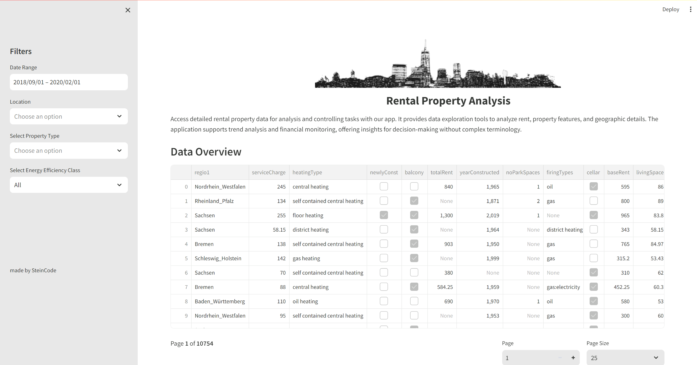
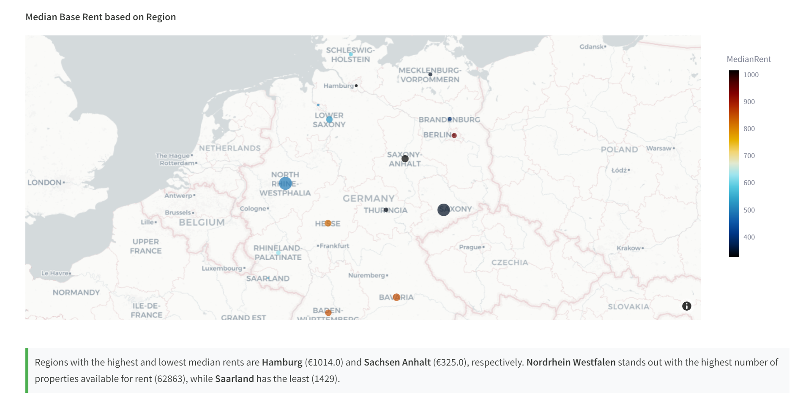
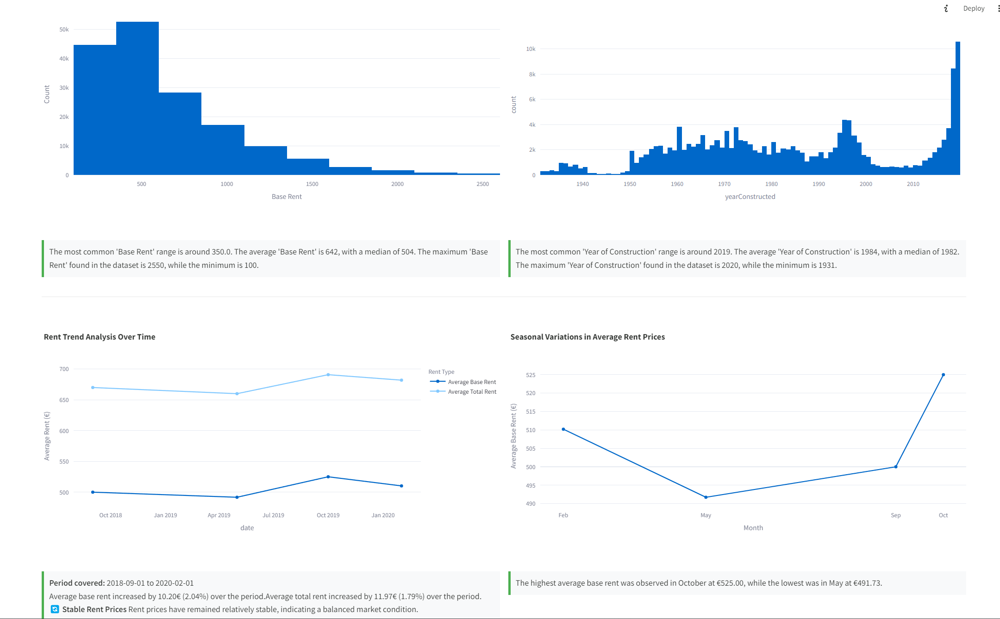
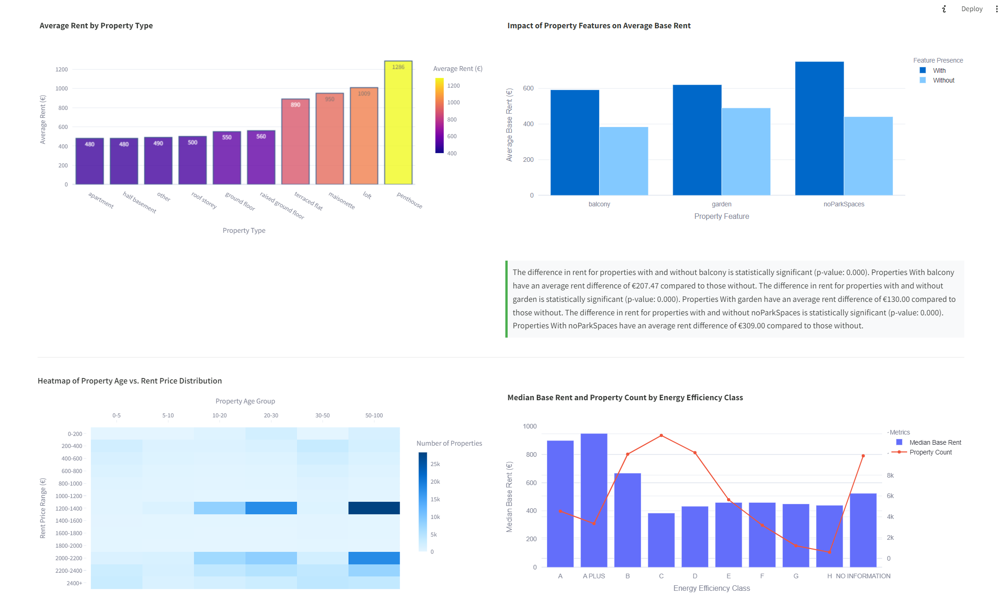
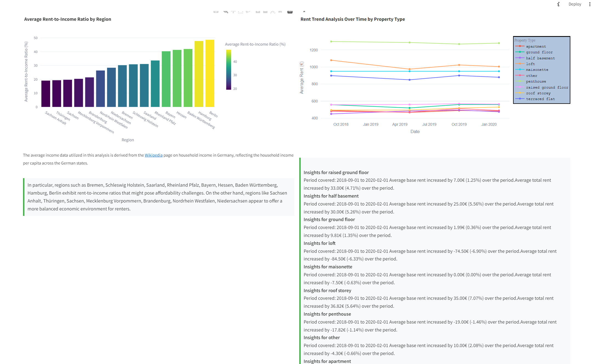

# 📈 Streamlit Real Estate Dashboard 

## Purpose
This project serves as a showcase for the capabilities of Streamlit to create professional dashboards with ease. The goal is to demonstrate the efficiency of using Streamlit for real estate market analysis, providing interactive and insightful visualizations.

## Project Structure
The project directory is organized as follows:

- `input/`: Contains the dataset `immo_data.csv` used for analysis.
- `img/`: Stores images used within the Streamlit app.
- `.streamlit/`: Configuration files for Streamlit.
- `app.py`: The main script to run the Streamlit app.
- `config.py`: Configuration settings for the app.
- `graphs.py`: Functions to create chart visualizations. 
- `dynamic_insights.py`: Dynamic insights generation based on data analysis.
- `process_data.py`: Data preprocessing and cleaning.
- `Pipfile` and `Pipfile.lock`: Pipenv configuration files for managing dependencies.

## Dataset Information
The dataset `immo_data.csv` includes real estate listings with details on property features, prices, location, and more. It is utilized to perform various analyses and to demonstrate the data handling capabilities of the app.
[Source](https://www.kaggle.com/datasets/corrieaar/apartment-rental-offers-in-germany)
## Analysis and Charts
The app includes multiple types of analysis and visualizations, such as:
- Wordcloud and Frequency Barchart of object description
- Trend analysis over time.
- Seasonal rental trends.
- Impact of property features on rental prices.
- Affordability analysis based on income levels.
- Comparative analysis of new vs. old properties.

The visualizations are created using Plotly Express to provide interactive charts, including line charts, bar charts, and heatmaps.
## Dynamic Insights
The application utilizes dynamic insights to assist users in comfortably interpreting the data. These insights add significant value by contextualizing the visualizations and providing actionable takeaways from the analyzed data.

## Interactivity and Filters
To enhance the dashboard's interactivity, filters have been integrated, allowing users to refine the data based on property type, region, energy efficiency class, and date range. These filters make the dashboard highly dynamic and tailored to user-specific queries.
## Packages Used
The project leverages several Python packages:
- `streamlit`: Framework for creating the web app.
- `polars`: High-performance DataFrame library.
- `pandas`: Data analysis and manipulation.
- `numpy`: Numerical computing.
- `plotly-express`: Interactive plotting.







## Methods
The app implements best practices in data preprocessing, interactive filtering, and dynamic insight generation. It utilizes Polars for efficient data processing, especially beneficial for large datasets.

## Getting Started
To run the app, you need to install the dependencies using Pipenv, which manages packages in a virtual environment. Install Pipenv and the dependencies with the following commands:

```bash
pip install pipenv
pipenv install

pipenv run streamlit run app.py
```

## Conclusio
Streamlit's ease of use is evident in the creation of this dashboard. While displaying large datasets in a table can be challenging, using Polars alongside Streamlit can significantly improve performance. This POV project highlights Streamlit's potential to transform data analysis into interactive and user-friendly web applications.

